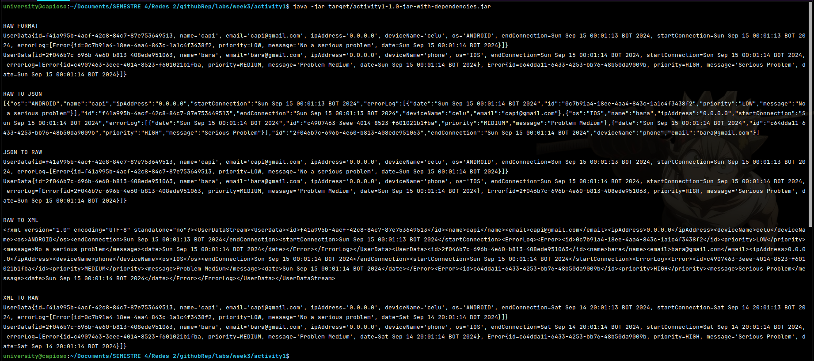

# Activity #1 - Data serialization

<!-- TOC -->
  * [1. Goal](#1-goal)
  * [2. Activity description](#2-activity-description)
  * [3. How to run](#3-how-to-run)
  * [4. Check the code](#4-check-the-code)
  * [5. Results](#5-results)
    * [5.1. Console](#51-console)
    * [5.2. RAW format](#52-raw-format)
    * [5.3. RAW to JSON](#53-raw-to-json)
    * [5.4. JSON to RAW](#54-json-to-raw)
    * [5.5. RAW TO XML](#55-raw-to-xml)
    * [5.6. XML TO RAW](#56-xml-to-raw)
  * [6. Advantages](#6-advantages)
  * [7. Disadvantages](#7-disadvantages)
  * [8. Extra](#8-extra)
<!-- TOC -->

## 1. Goal
> Understand the JSON, XML data transfer format

## 2. Activity description
> *JSON vs XML*
>
> * By studying a real use case for collecting data from an environment such as a University Campus, define a data structure in JSON and XML format that represents user connections with basic data:
> * * Name
> * * Email
> * * ID
> * * IP address
> * * Device name
> * * OS
> * * Start connection
> * * End connection
> * * Errors: List of errors with date and time, error message, priority level.
> * Using a programming language in C# or Java, create a program that allows for the serialization and deserialization of the above information.
> * Compare the advantages and disadvantages in terms of size, readability, user-friendliness, analysis, etc.

## 3. How to run
> * Ensure to be in the project path
> ```shell
> cd labs/week3/activity1
> ```
> * Get the JAR file
> ```shell
> mvn clean && mvn compile && mvn package
> ```
> * Run the JAR
> ```shell
> java -jar target/activity1-1.0-jar-with-dependencies.jar
> ```
## 4. Check the code
> * [Route to root package](src/main/java/networksTwo)
> * [Check the main class](src/main/java/networksTwo/Main.java)
## 5. Results
### 5.1. Console



### 5.2. RAW format
```shell
UserData{id=e540b7e4-deb9-4c39-b8a4-a52402f5bfbd, name='capi', email='capi@gmail.com', ipAddress='0.0.0.0', deviceName='celu', os='ANDROID', endConnection=Sat Sep 14 16:36:23 BOT 2024, startConnection=Sat Sep 14 16:36:23 BOT 2024, errorLog=[Error{id=2328b3bd-9499-4896-906a-01dcbd56c243, priority=LOW, message='No a serious problem', date=Sat Sep 14 16:36:23 BOT 2024}]}
UserData{id=1a46daf7-d5a7-4cc5-8f36-4083f4860941, name='bara', email='bara@gmail.com', ipAddress='0.0.0.0', deviceName='phone', os='IOS', endConnection=Sat Sep 14 16:36:23 BOT 2024, startConnection=Sat Sep 14 16:36:23 BOT 2024, errorLog=[Error{id=4c9ded77-be1f-408a-88e7-14bb8d1f9f5a, priority=MEDIUM, message='Problem Medium', date=Sat Sep 14 16:36:23 BOT 2024}, Error{id=f4368596-9c0e-4fe4-b2a6-1cf929d08688, priority=HIGH, message='Serious Problem', date=Sat Sep 14 16:36:23 BOT 2024}]}
```
### 5.3. RAW to JSON
> ```JSON
> [
>   {
>     "os": "ANDROID",
>     "name": "capi",
>     "ipAddress": "0.0.0.0",
>     "startConnection": "Sat Sep 14 16:36:23 BOT 2024",
>     "errorLog": [
>       {
>         "date": "Sat Sep 14 16:36:23 BOT 2024",
>         "id": "2328b3bd-9499-4896-906a-01dcbd56c243",
>         "priority": "LOW",
>         "message": "No a serious problem"
>       }
>     ],
>     "id": "e540b7e4-deb9-4c39-b8a4-a52402f5bfbd",
>     "endConnection": "Sat Sep 14 16:36:23 BOT 2024",
>     "deviceName": "celu",
>     "email": "capi@gmail.com"
>   },
>   {
>     "os": "IOS",
>     "name": "bara",
>     "ipAddress": "0.0.0.0",
>     "startConnection": "Sat Sep 14 16:36:23 BOT 2024",
>     "errorLog": [
>       {
>         "date": "Sat Sep 14 16:36:23 BOT 2024",
>         "id": "4c9ded77-be1f-408a-88e7-14bb8d1f9f5a",
>         "priority": "MEDIUM",
>         "message": "Problem Medium"
>       },
>       {
>         "date": "Sat Sep 14 16:36:23 BOT 2024",
>         "id": "f4368596-9c0e-4fe4-b2a6-1cf929d08688",
>         "priority": "HIGH",
>         "message": "Serious Problem"
>       }
>     ],
>     "id": "1a46daf7-d5a7-4cc5-8f36-4083f4860941",
>     "endConnection": "Sat Sep 14 16:36:23 BOT 2024",
>     "deviceName": "phone",
>     "email": "bara@gmail.com"
>   }
> ]
> ```
### 5.4. JSON to RAW
> ```shell
> UserData{id=e540b7e4-deb9-4c39-b8a4-a52402f5bfbd, name='capi', email='capi@gmail.com', ipAddress='0.0.0.0', deviceName='celu', os='ANDROID', endConnection=Sat Sep 14 16:36:23 BOT 2024, startConnection=Sat Sep 14 16:36:23 BOT 2024, errorLog=[Error{id=e540b7e4-deb9-4c39-b8a4-a52402f5bfbd, priority=LOW, message='No a serious problem', date=Sat Sep 14 16:36:23 BOT 2024}]}
> UserData{id=1a46daf7-d5a7-4cc5-8f36-4083f4860941, name='bara', email='bara@gmail.com', ipAddress='0.0.0.0', deviceName='phone', os='IOS', endConnection=Sat Sep 14 16:36:23 BOT 2024, startConnection=Sat Sep 14 16:36:23 BOT 2024, errorLog=[Error{id=1a46daf7-d5a7-4cc5-8f36-4083f4860941, priority=MEDIUM, message='Problem Medium', date=Sat Sep 14 16:36:23 BOT 2024}, Error{id=1a46daf7-d5a7-4cc5-8f36-4083f4860941, priority=HIGH, message='Serious Problem', date=Sat Sep 14 16:36:23 BOT 2024}]}
> ```
### 5.5. RAW TO XML
> ```XML
> <?xml version="1.0" encoding="UTF-8" standalone="no"?>
> <UserDataStream>
>     <UserData>
>         <id>e540b7e4-deb9-4c39-b8a4-a52402f5bfbd</id>
>         <name>capi</name>
>         <email>capi@gmail.com</email>
>         <ipAddress>0.0.0.0</ipAddress>
>         <deviceName>celu</deviceName>
>         <os>ANDROID</os>
>         <endConnection>Sat Sep 14 16:36:23 BOT 2024</endConnection>
>         <startConnection>Sat Sep 14 16:36:23 BOT 2024</startConnection>
>         <ErrorLog>
>             <Error>
>                 <id>2328b3bd-9499-4896-906a-01dcbd56c243</id>
>                 <priority>LOW</priority>
>                 <message>No a serious problem</message>
>                 <date>Sat Sep 14 16:36:23 BOT 2024</date>
>             </Error>
>         </ErrorLog>
>     </UserData>
>     <UserData>
>         <id>1a46daf7-d5a7-4cc5-8f36-4083f4860941</id>
>         <name>bara</name>
>         <email>bara@gmail.com</email>
>         <ipAddress>0.0.0.0</ipAddress>
>         <deviceName>phone</deviceName>
>         <os>IOS</os>
>         <endConnection>Sat Sep 14 16:36:23 BOT 2024</endConnection>
>         <startConnection>Sat Sep 14 16:36:23 BOT 2024</startConnection>
>         <ErrorLog>
>             <Error>
>                 <id>4c9ded77-be1f-408a-88e7-14bb8d1f9f5a</id>
>                 <priority>MEDIUM</priority>
>                 <message>Problem Medium</message>
>                 <date>Sat Sep 14 16:36:23 BOT 2024</date>
>             </Error>
>             <Error>
>                 <id>f4368596-9c0e-4fe4-b2a6-1cf929d08688</id>
>                 <priority>HIGH</priority>
>                 <message>Serious Problem</message>
>                 <date>Sat Sep 14 16:36:23 BOT 2024</date>
>             </Error>
>         </ErrorLog>
>     </UserData>
> </UserDataStream>
> ```
### 5.6. XML TO RAW
> ```shell
> UserData{id=e540b7e4-deb9-4c39-b8a4-a52402f5bfbd, name='capi', email='capi@gmail.com', ipAddress='0.0.0.0', deviceName='celu', os='ANDROID', endConnection=Sat Sep 14 12:36:23 BOT 2024, startConnection=Sat Sep 14 12:36:23 BOT 2024, errorLog=[Error{id=2328b3bd-9499-4896-906a-01dcbd56c243, priority=LOW, message='No a serious problem', date=Sat Sep 14 12:36:23 BOT 2024}]}
> UserData{id=1a46daf7-d5a7-4cc5-8f36-4083f4860941, name='bara', email='bara@gmail.com', ipAddress='0.0.0.0', deviceName='phone', os='IOS', endConnection=Sat Sep 14 12:36:23 BOT 2024, startConnection=Sat Sep 14 12:36:23 BOT 2024, errorLog=[Error{id=4c9ded77-be1f-408a-88e7-14bb8d1f9f5a, priority=MEDIUM, message='Problem Medium', date=Sat Sep 14 12:36:23 BOT 2024}, Error{id=f4368596-9c0e-4fe4-b2a6-1cf929d08688, priority=HIGH, message='Serious Problem', date=Sat Sep 14 12:36:23 BOT 2024}]}
> ```
## 6. Advantages
> * Parsing raw to JSON and JSON to raw is quite easier even for dates, enums, arrays. So complex datatypes are easy to manage.
> * Parser code can be easily managed and it is fully readable.
## 7. Disadvantages
> * XML is pretty harder to configure, it needs to generate a document and upload there the content.
> * Date type is almost impossible to configure when deserializing XML to Raw.
> * Hard to follow the transformation of the data when deserializing XML to Raw.
## 8. Extra
> I was wondering if you could give me feedback about my architecture, I'm trying to apply a Microservices Architecture.