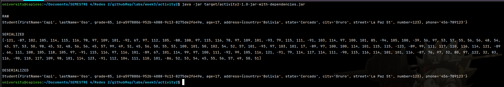
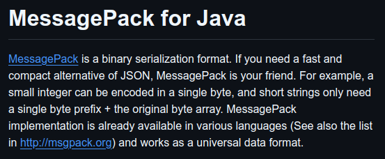

# Activity #2 - MessagePack for data serializing

<!-- TOC -->
  * [1. Goal](#1-goal)
  * [2. Activity description](#2-activity-description)
  * [3. How to run](#3-how-to-run)
  * [4. Check the code](#4-check-the-code)
  * [5. Results](#5-results)
<!-- TOC -->

## 1. Goal
> Review alternatives to JSON and XML for data serialization.

## 2. Activity description
> * MessagePack is an alternative for data serialization.
> * Create a Java program to serialize data using the library: https://github.com/msgpack/msgpack-java to an external site.
> * Instantiate a simple object with this information:
> * * First Name,
> * * Last Name,
> * * Grade,
> * * ID,
> * * Age,
> * * Address: Country, State, Sity, Street, Number
> * * Phone
> * Use the MessagePack library to serialize the object and print the result on the console screen.
> * Use the MessageUnpacker library to deserialize the object and print the result on the screen.
> * Compare the format with JSON and XML.
## 3. How to run
> * Ensure to be in the project path
> ```shell
> cd labs/week3/activity2
> ```
> * Get the JAR file
> ```shell
> mvn clean && mvn compile && mvn package
> ```
> * Run the JAR
> ```shell
> java -jar target/activity2-1.0-jar-with-dependencies.jar
> ```
## 4. Check the code
> * [Route to root package](src/main/java/networksTwo)
> * [Check the main class](src/main/java/networksTwo/Main.java)
## 5. Results



> As the MessagePack is built for JSON then the data serialization and deserialization have been done from RAW to JSON & JSON to RAW. Not for XML.
> 
> 

