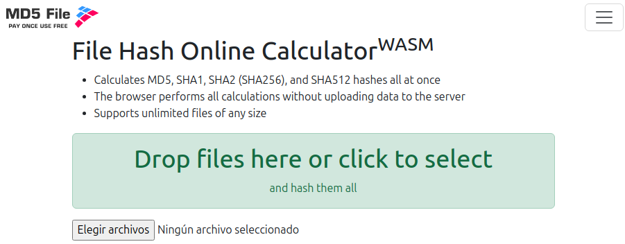

# Activity #3 - Data Integrity


## 1. Background
> Introduce data integrity validation using MD5.

## 2. Activity description

> * Find an online tool, or a free SW tool or a library for Java that allows to generate an MD5 hash code for any file.
> * Create a .txt file with some lines typed and generate an MD5 hash code for the file.
> * Edit the file by adding or removing lines of text, and generate the MD5 hash code again.
> * Compare both MD5 hash codes.
> * Find an online alternative to MD5 and describe its use, advantages and disadvantages.

## 3. Online tool
The following tool seemed to be very complete and easy to use: https://md5file.com/calculator



## 4. Steps
### 4.1. TXT file
> The TXT file called `content.txt` is stored in: [src](src), with the following content:
> ```text
> This is my original content:
> 
> Nice to hear news from you!
> ```
### 4.2. Getting MD5 hash code
> The result of the site was:
> ```text
> content.txt - 57 bytes
> 
> MD5: d00448b620d26b9e3e98a43d506f4ac7
> SHA1: 515f38edc7b63c23ca14533471aee8be53e9134a
> SHA256: aa78b88d5411f5605212b10b91872faef69f3374bcd7682e8ba8a86ad913d696
> SHA512: 33f37a1090380633a12f55c1266e91d73d0a8bfb9d645da00774a8633d35fb5c470af2171d9d2df6b401ea7d1fb22f37c3c22109d271ec8d2b60d93c6e89c0d8
> ```
> Essentially, the MD5 hash code is: 
> ```text
> MD5: d00448b620d26b9e3e98a43d506f4ac7
> ```
### 4.3. Editing TXT file
> The new content of the TXT file is:
> ```text
> This is my original content:
> Bad news my friend :"3
> ```
### 4.4. Extracting MD5 hash code
> ```text
> content.txt - 51 bytes
> 
> MD5: 18edc4afb1e9fe307b42a2a07556baa9
> SHA1: df3e1a12c867deaa78bc19472d11b8051a97aa35
> SHA256: d2b41116e413b637fb903815460e67a4a166e139ea998a28d23ae1e02429978f
> SHA512: 8eb9fddf35aa2b5542b2fd5675d6f24ba72c2609360abb438cbfb45175baf1eefdc0ac9a1451e09ecfb2fafe9129180fde738fd83e3d30e049420918de18f215
> ```
> Essentially, the MD5 hash code is:
> ```text
> MD5: 18edc4afb1e9fe307b42a2a07556baa9
> ```
### 4.5. Comparison

|             ORIGINAL             |              EDITED              |
|:--------------------------------:|:--------------------------------:|
| d00448b620d26b9e3e98a43d506f4ac7 | 18edc4afb1e9fe307b42a2a07556baa9 |
 
> * Both are different.
> * Both have the same quantity of characters.

## 5. Alternatives
> Just by reading the web page which extracted the MD5 hash code, it is possible to find some alternatives:
> * SHA1
> * SHA256
> * SHA512
### 5.1. SHA1
> In order to offer some context, it is important to read about entities that directly influences into the use of these cryptographic algorithms, about NIST (National Institute of Standards and Technology) and CSRC (Computer Security Resource Center).
> 
> The Computer Security Resource Center (CSRC) has information on many of NIST's cybersecurity- and information security-related projects, publications, news and events. CSRC supports people and organizations in government, industry, and academia—both in the U.S. and internationally. So, what did it thinks about this algorithm:
> 
> `SHA-1 can still be used to verify old time stamps and digital signatures, but the NIST (National Institute of Standards and Technology) does not recommend using SHA-1 to generate digital signatures or in cases where collision resistance is required. `
> 
> Summarizing, the use of SHA1 has been deprecated, check more about it here: https://csrc.nist.gov/projects/hash-functions
### 5.2. SHA256 & SHA512
> For instance, both algorithms are still eligible. In fact, all SHA-2 family (SHA-224, SHA-256, SHA-384, SHA-512, SHA-512/224, and SHA-512/256) of cryptographic hash functions are still available as secure algorithms but there's a new family that has taken relevance since it demonstrated that it was better while facing:
> * **Collision resistance:** It is computationally infeasible to find two different inputs to the hash function that have the same hash value.
> * **Preimage resistance:** Given a randomly chosen hash value, it is computationally infeasible to find an input message that hashes to this hash value.
> * **Second preimage resistance:** It is computationally infeasible to find a second input that has the same hash value as any other specified input. 
> This family is the SHA-3.

### 5.3. SHA-3 Family
> In 2004-2005, several cryptographic hash algorithms were successfully attacked, and serious attacks were published against the NIST-approved SHA-1. In response, NIST held two public workshops to assess the status of its approved hash algorithms, and to solicit public input on its cryptographic hash algorithm policy and standard. As a result of these workshops, NIST decided to develop a new cryptographic hash algorithm for standardization through a public competition. The new hash algorithm would be referred to as SHA-3.
> 
> NIST announced the SHA-3 Cryptographic Hash Algorithm Competition on November 2, 2007, and ended the competition on October 2, 2012, when it announced KECCAK as the winning algorithm to be standardized as the new SHA-3.
> 
> This family is composed by: 
> * Four fixed-length hash algorithms: SHA3-224, SHA3-256, SHA3-384, and SHA3-512
> * Two closely related, “extendable-output” functions (XOFs): SHAKE128 and SHAKE256.
> 
> Finally, any algorithm of this family is definitively a better option to MD5.

### 6. Bibliography
> * Hash functions. (2017a, January 4). CSRC | NIST. https://csrc.nist.gov/projects/hash-functions
> * Hash functions. (2017b, January 4). CSRC | NIST. https://csrc.nist.gov/projects/hash-functions/sha-3-project
> * WASM file hash online calculator - MD5, SHA1, SHA2 (SHA256), SHA512. (n.d.). Md5file.com. Retrieved September 15, 2024, from https://md5file.com/calculator
> * What is MD5? Understanding Message-Digest Algorithms. (n.d.). Okta.com. Retrieved September 15, 2024, from https://www.okta.com/identity-101/md5/