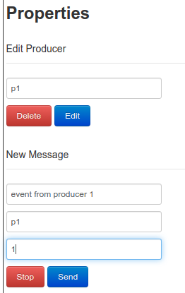

# Activity #1 - Publisher Subscriber
> **Author:** *Alexis Segales*

# Pub-Sub Pattern
> Publisher-subscriber is a messaging pattern with two components:
> 
> * **Publishers:** Artifacts or instances that emit messages without a deep interest in who is the receiver interested in processing those messages.
> * **Subscribers:** Artifacts or instances that express an interest in specific messages, and only receive and process those messages in which they show interest.
> * **Topics:** Channels or categories of messages issued or published.
> * **Message Broker:** An intermediary queue in charge of managing messages between publishers and subscribers.

# The mission
> * Using the RabbitMQ simulator https://tryrabbitmq.com/
> * Generate a simple PUS/SUB architecture with 2 publishers and 1 subscriber that will consume the messages emitted by the publishers.
> * Test the architecture by sending messages from both publishers and capturing the processing received by the subscriber.
> * Explain a real use case to be used for sending and consuming messages.

# The work
> The requirements express that it is needed to have two publishers and a single subscriber.
>
> 
> 
> In order to show how there are two publishers sending messages at the same time, the configuration for each one was:
> 
> 
> 
> 
> 
> In order to segregate the different messages, I applied a key to the bind between ex1 and queue1. It allowed me to filter what kind of message I wanted my client could receive. As result of this operation, the logger has the same information:
> 
> 
> 
> You can watch it on the following video:
> 
> [video.mp4](video.mp4)

# Use Case
> In fact, the act of sending anything implies to receive and act in consequence of that anything. So If I send a message to a friend, my friend application must receive an alert that a message has been sent to him, and it must act alert to my friend that a new message has been received.