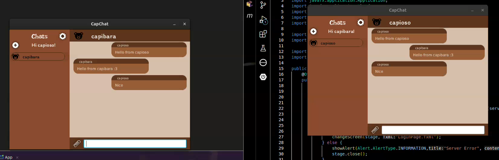

# Activity #2 - Application for sending and receiving messages
> **Author:** *Alexis Segales*

## You can check the server application here:
> https://github.com/capioso/ServerApp/tree/Lab4Activity2

## You can check the client application here:
> https://github.com/capioso/Client/tree/Lab4Activity2

## Running Proof
> Watch the following short video: [proof.mp4](proof.mp4)
> 
> 
>
> * In fact, the socket settings are stored in the `ServerConfig.java` and `TlsConfig.java` files, from the server. Both stores in `config` directory.
> * By the client side, the connection and socket settings are stored in config directory.