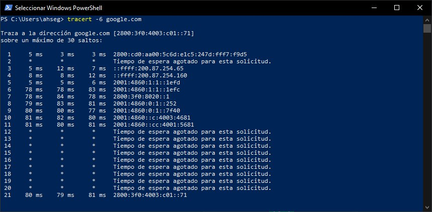
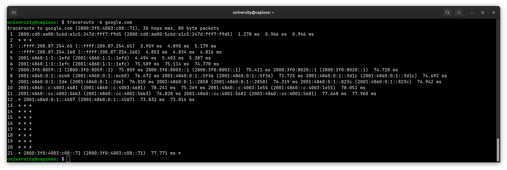
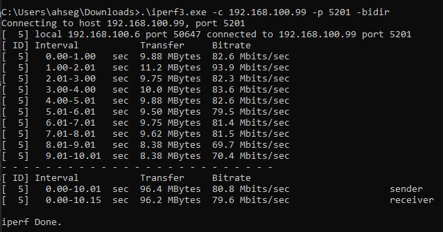
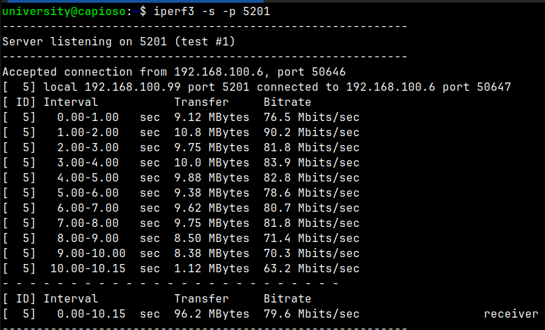

# Activity #1 - Network Monitoring
> **Author:** *Alexis Segales*

# 1. Hosts information
> * Laptop with Windows
> * Laptop with Ubuntu

# 2. Software needed
> * Tracer/Traceroute/Tracert
> * Iperf3

# 3. Trace Route
## 3.1. Result from Windows Client

### 3.1.1. Analysis
> * **Packages lost on jump 2:** I think that as I manage an older router acting as a simple repeater, it may result on ignoring the ICMP packages that traceroute uses. 
> * **Latency increased in jump 6:** The difference between jump 6 and 5 is more to 70 ms which means a 15-times delay in the connection. It is probably a bottleneck related to nodes that take my connection out of my city or country.
## 3.2. Result from Ubuntu Client

### 3.2.1. Analysis
> * **Latency increased in jump 6:** The difference between jump 6 and 5 is close to 70 ms which means a 14-times delay in the connection. It is probably a bottleneck related to nodes that take my connection out of my city or country.
> * **Packages lost on jump 2:** I think that as I manage an older router acting as a simple repeater, it may result on ignoring the ICMP packages that traceroute uses.

# 4. Iperf3

## 4.1. Windows Host

## 4.2. Ubuntu Server

## 4.3. Analysis
> * The client sends data to the server in 1-second intervals. 
> * The transfer rate varies at each interval, with values between 63.2 Mbits/sec and 90.2 Mbits/sec. 
> * In total, in an interval of 10.15 seconds, 96.2 MBytes have been transferred with an average transfer rate of 79.6 Mbits/sec. 
> * This result shows that the speed of the network connection between the two devices is relatively stable, with an average transfer rate of 79.6 Mbits/sec.

# 5. Alternatives
> The following website: [CompariTech](https://www.comparitech.com/net-admin/best-traceroute-alternatives/) has a summarized list of alternatives:
> * **SolarWinds Engineer’s Toolset EDITOR’S CHOICE:** A powerful, multi-featured network monitoring tool that not only offers traceroute capabilities but numerous other features that can help an administrator take control of the network.
> * **Open Visual Traceroute:** Free alternative that presents the output in 3D maps for easier comprehension; it works on any operating system and is easy enough for even non-tech savvy users to operate.
> * **PingPlotter:** Free network monitoring and route analysis tool; it comes in various editions that cater to all requirements from individual devices to corporate networks and even Cloud Computing.
> * **Paessler PRTG Network Monitoring:** Suite of tools that give full control of a network to the administrator; the traceroute feature works in collaboration with the other tools which helps in getting a deeper insight into the current state of a network’s health.
> * **Path Analyzer Pro:** Light, no-nonsense traceroute tool that delivers quickly and presents its findings in a clear comprehensible format; it comes with other network troubleshooting tools too.
> * **NetScanTools:** This suite of tools packs a heavy punch when it comes to network traffic data analysis; it has tools that help administrators truly understand their network.
 
