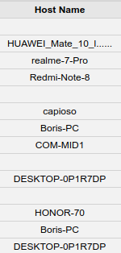
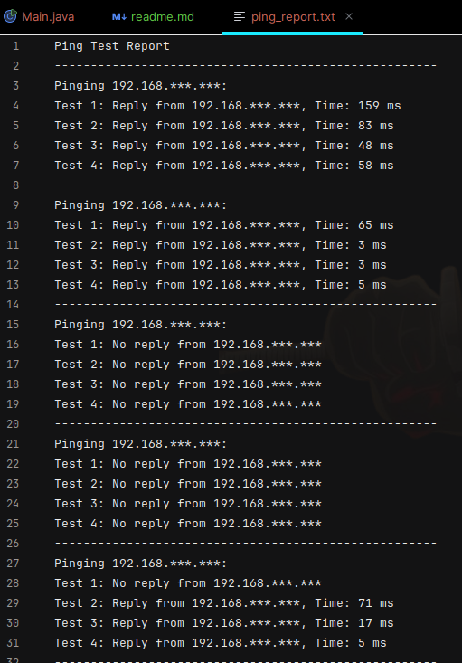

# Activity #2 - Monitoring Automation
> **Author:** *Alexis Segales*

# 1. Description
> You are assigned the role of Network Administrator in the IT department, and a periodic task you have is to verify by pinging that each computer connected to the network is responding properly.
> 
> This task is currently performed manually through ping commands on the console, capturing the results and response time.
> 
> You are requested to:
> * Write a program in C# or Java that allows to execute a ping to a predefined list of hosts, displaying their connection results, response time, and communication errors.
> * With this information generate a report summarizing the results of the execution of several tests (at least 10) including the IP address, the response time and if there were any errors.
# 2. IP Population
> I get information from my own router:
>
> 
> 
> But I send the IP addresses by using the args array (CLI arguments) in main method, because I don't want to make public that kind of information.
# 3. Result
> The final two octets have been covered by me, but the original report prints the entire IP ADDRESS, so don't worry about the result. 
> 
> 
>
> The report is autogenerated in the root path of the project.