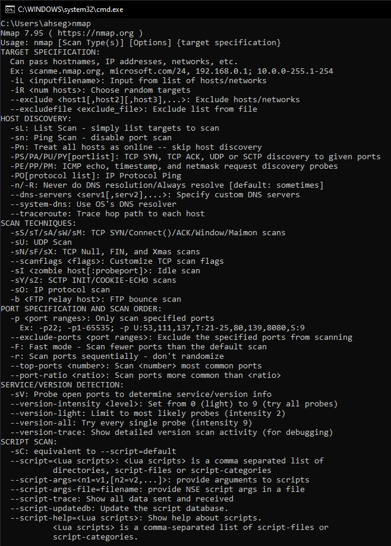
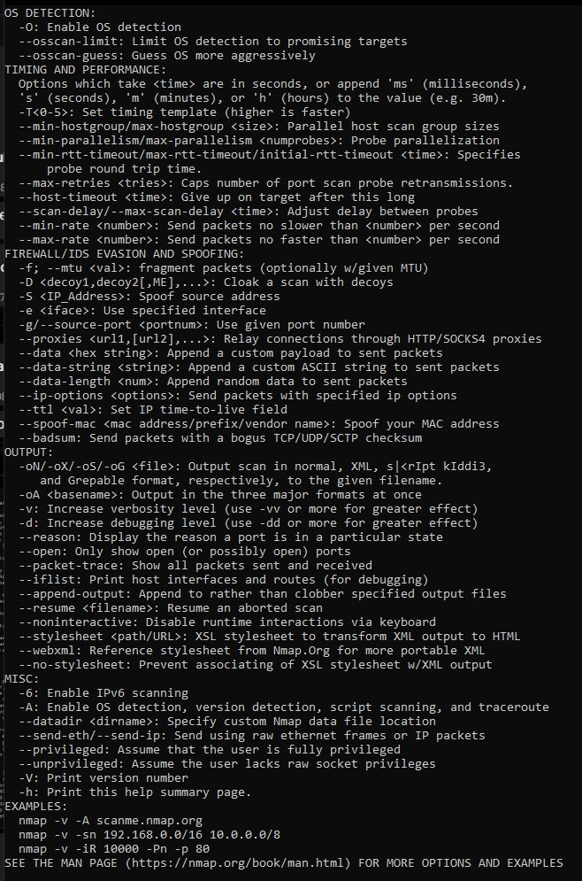
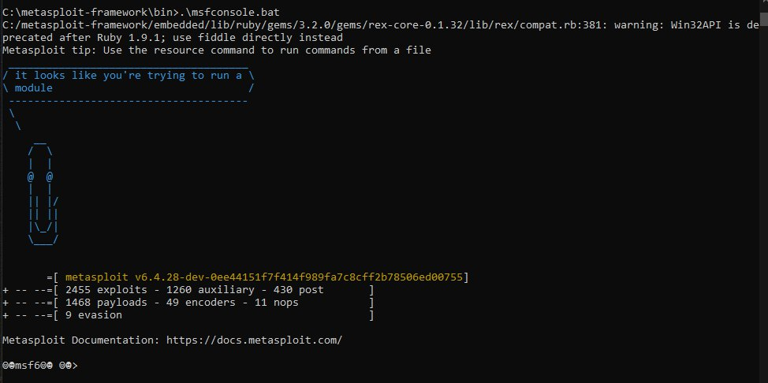
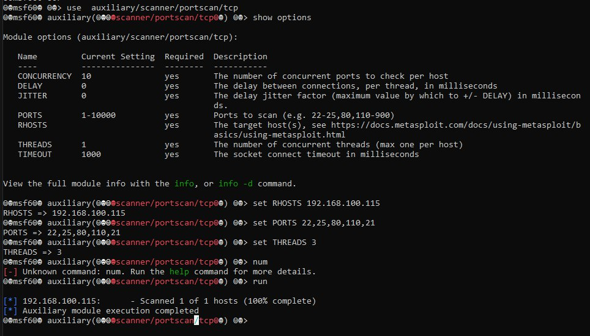
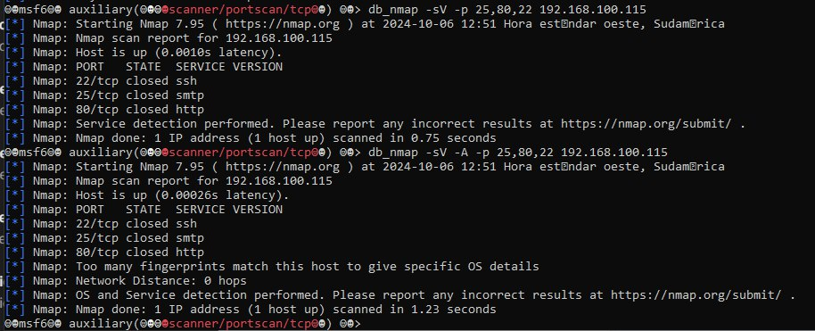

# Activity #1 - Vulnerability Detection
> **Author:** *Alexis Segales*

<!-- TOC -->
* [Activity #1 - Vulnerability Detection](#activity-1---vulnerability-detection)
  * [1. Run and explain: nmap](#1-run-and-explain-nmap)
  * [2. Run and explain: metasploit](#2-run-and-explain-metasploit)
    * [2.1. Initializing the database](#21-initializing-the-database)
    * [2.2. Running the metasploit console](#22-running-the-metasploit-console)
    * [2.3. Setting up and running metasploit](#23-setting-up-and-running-metasploit)
<!-- TOC -->

## 1. Run and explain: nmap
> Using nmap directly in the Windows console is the equivalent of using nmap -help, it is just a summary of how to use its services plus a description of what each action does, to see more details you can use the man command. 
> 
> 
> 
> 
## 2. Run and explain: metasploit
### 2.1. Initializing the database
> It handles a PostgresSQL database, so I had to install it first.
> 
> ```shell
> C:\metasploit-framework\bin>.\msfdb.bat initC:/metasploit-framework/embedded/lib/ruby/gems/3.2.0/gems/rex-core-0.1.32/lib/rex/compat.rb:381: warning: Win32API is deprecated after Ruby 1.9.1; use fiddle directly instead
> Using database port 5432 found in C:/Users/ahseg/.msf4/database.ymlRunning the 'init' command for the database:
> Existing database running
> ```
> 
> After testing, I realized that DB with PostgresSQL was not easy to create. In fact, to create the DB for metasploit, it is needed to create a yaml inside the install directory of metasploit.
### 2.2. Running the metasploit console
> At this point I encountered a very complicated problem to solve:
> ```shell
> C:\metasploit-framework\bin>.\msfconsole.bat
> C:/metasploit-framework/embedded/lib/ruby/gems/3.2.0/gems/rex-core-0.1.32/lib/rex/compat.rb:381: warning: Win32API is deprecated after Ruby 1.9.1; use fiddle directly instead Metasploit tip: Network adapter names can be used for IP options set LHOST eth0 
> C:/metasploit-framework/embedded/framework/lib/net/dns/resolver.rb:282:in `searchlist=': Wrong argument format, neither String nor Array (ResolverArgumentError) from 
> C:/metasploit-framework/embedded/framework/lib/net/dns/resolver.rb:1084:in `parse_config_file' from C:/metasploit-framework/embedded/framework/lib/rex/proto/dns/resolver.rb:66:in `initialize' from 
> C:/metasploit-framework/embedded/framework/lib/rex/proto/dns/cached_resolver.rb:25:in `initialize' from C:/metasploit-framework/embedded/framework/lib/msf/ui/console/driver.rb:82:in `new' from 
> C:/metasploit-framework/embedded/framework/lib/msf/ui/console/driver.rb:82:in `initialize' from C:/metasploit-framework/embedded/framework/lib/metasploit/framework/command/console.rb:66:in `new' from 
> C:/metasploit-framework/embedded/framework/lib/metasploit/framework/command/console.rb:66:in `driver' from C:/metasploit-framework/embedded/framework/lib/metasploit/framework/command/console.rb:54:in `start' from 
> C:/metasploit-framework/embedded/framework/lib/metasploit/framework/command/base.rb:82:in `start' from C:/metasploit-framework/bin/../embedded/framework/msfconsole:25:in `<main>'
> ```
> I worked on this for almost 3 hours, the solution I found was here in this page:
> * https://github.com/rapid7/metasploit-framework/blob/master/lib/net/dns/resolver.rb
> 
> Changing the entire file in: `C:\metasploit-framework\embedded\framework\lib\net\dns`
> 
> 
> 
### 2.3. Setting up and running metasploit
>  
> 
> 
> 