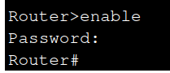

# Activity #2 - Network Security
> **Author:** *Alexis Segales*

<!-- TOC -->
* [Activity #2 - Network Security](#activity-2---network-security)
  * [Create a network with 3 segments](#create-a-network-with-3-segments)
  * [Requirements](#requirements)
<!-- TOC -->

## Create a network with 3 segments
> * **Management:** Network segment with some services for internal resource management.
> * **Employees:** Network segment with client devices for employees and a file transfer service.
> * **Public:** Network segment with devices that allow Internet access to employees.
> 
> 
> 
> CHECK THE `.pkt` file here: [activity2.pkt](activity2.pkt)
## Requirements
> * Secure access to the router using a username and password. 
> > * * **Enable**
> > ```shell
> > Router(config)# enable secret Cisco123
> > Router(config)# exit
> > ```
> > 
> > 
>
> > * * **VTY connections**
> > ```shell
> > Router(config)# username admin privilege 15 secret adminpass
> > Router(config)# line vty 0 4
> > Router(config-line)# login local
> > Router(config-line)# exit
> > ```
> > 
> > 
> > 

* Allow employees to access Internet services via HTTP, HTTPS protocols from the Public segment.

> ```shell
> Router(config)# access-list 101 permit tcp 192.168.20.0 0.0.0.255 any eq 80
> Router(config)# access-list 101 permit tcp 192.168.20.0 0.0.0.255 any eq 443
> ```
> 
> 

* Block any remote access request to the Management segment from the Public and Employee segments.

> ```shell
> Router(config)# access-list 102 deny ip 192.168.30.0 0.0.0.255 192.168.10.0 0.0.0.255
> Router(config)# access-list 102 deny ip 192.168.20.0 0.0.0.255 192.168.10.0 0.0.0.255
> ```
> 
> 
> 
> 

* Restrict file sharing service from the Employee segment to other segments. 

> ```shell
> Router(config)# access-list 103 deny tcp any 192.168.20.0 0.0.0.255 eq 21
> ```
> 
> 
> 
> 
> 
> 

* Allow HTTP and HTTPS service access from the Management segment to the Employee and Public segments.

> ```shell
> Router(config)# access-list 104 permit tcp 192.168.10.0 0.0.0.255 192.168.20.0 0.0.0.255 eq 80
> Router(config)# access-list 104 permit tcp 192.168.10.0 0.0.0.255 192.168.30.0 0.0.0.255 eq 80
> ```
> 
> 
> 
> 

