# Activity #3 - DDOS Attack Simulation
> **Author:** *Alexis Segales*

<!-- TOC -->
* [Activity #3 - DDOS Attack Simulation](#activity-3---ddos-attack-simulation)
  * [Background](#background)
  * [Activity Description](#activity-description)
  * [The server](#the-server)
  * [Apache Installation](#apache-installation)
  * [Hyenae Installation](#hyenae-installation)
  * [Before DDOS attack](#before-ddos-attack)
  * [Launching attack](#launching-attack)
  * [During DDOS attack](#during-ddos-attack)
  * [Mitigation strategy](#mitigation-strategy)
    * [Implement Robust Network Security Infrastructure](#implement-robust-network-security-infrastructure)
    * [Leverage DDoS Protection Services](#leverage-ddos-protection-services)
    * [Use Content Delivery Networks (CDNs)](#use-content-delivery-networks-cdns)
    * [Adopt Rate Limiting and Traffic Shaping](#adopt-rate-limiting-and-traffic-shaping)
    * [Create a Response Plan](#create-a-response-plan)
    * [Ensure Redundancy and Failover Mechanisms](#ensure-redundancy-and-failover-mechanisms)
    * [Educate and Train Your Team](#educate-and-train-your-team)
    * [Monitor Traffic and Gather Intelligence](#monitor-traffic-and-gather-intelligence)
    * [Engage with Your ISP](#engage-with-your-isp)
    * [Stay Informed About Emerging Threats](#stay-informed-about-emerging-threats)
<!-- TOC -->

## Background
> Review a common case of vulnerability in computer networks.

## Activity Description

> * Create a simulated network connection with a server and several client hosts, a controlled denial of service attack (DDoS attack) will be launched against a web service.
> * Install a web server, for example using apache HTTP server.
> * Download a DDoS attack simulator e.g. [Hyenae](https://github.com/r-richter/hyenaeLinks)
> * Launch the DDoS attack simulation application with low-bandwidth to avoid overloading the server or the network, verify that this option is selected.
> * Monitor the performance of the server using appropriate tools such as Netstat to observe incoming connections.
> * Observe the impact of the simulated attack on the Web server response to connection requests.

## The server
> I used the Ubuntu server created in Laboratory 2, plus adding a bridge interface to connect by ssh from my host:
> 
> 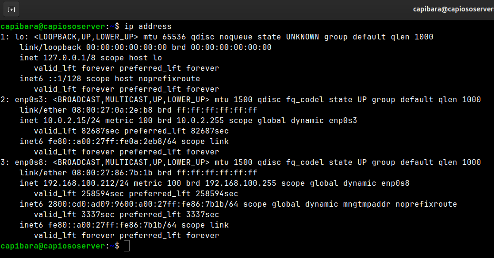

## Apache Installation
> I created a http server by using Apache inside Ubuntu Server:
>
> 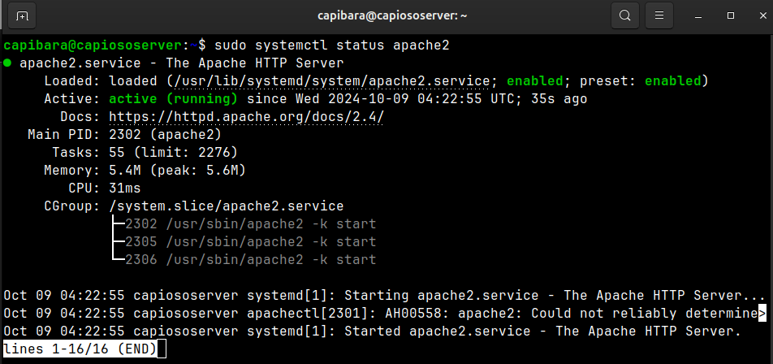
>
> And I used it from my host:
>
> 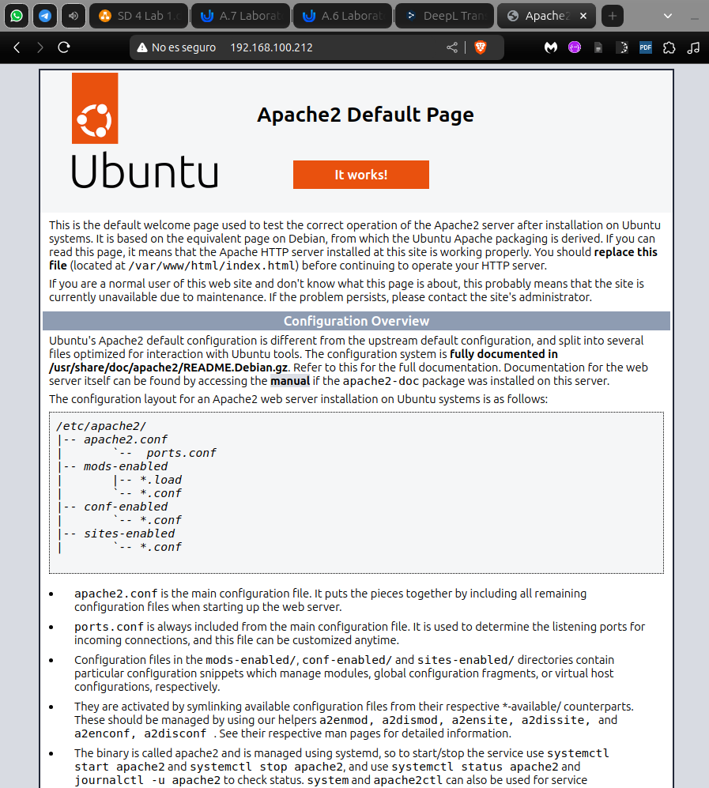
>
> It is needed to mention that HTTP uses the port `80`, so keep it open on the firewall.

## Hyenae Installation
> I had to create a directory to download Hyenae:
> 
> 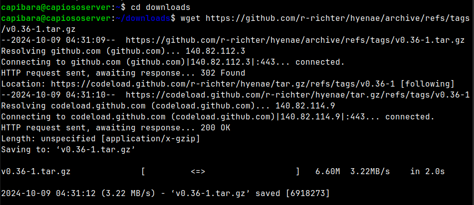
> 
> Then, I had to unpack the code:
> 
> 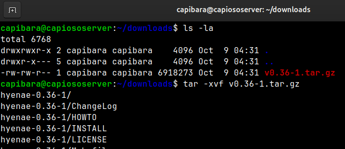
> 
> I realized that there was a pkg directory, which I thought that was the right way to generate a deb package and directly use Hyenae:
> 
> 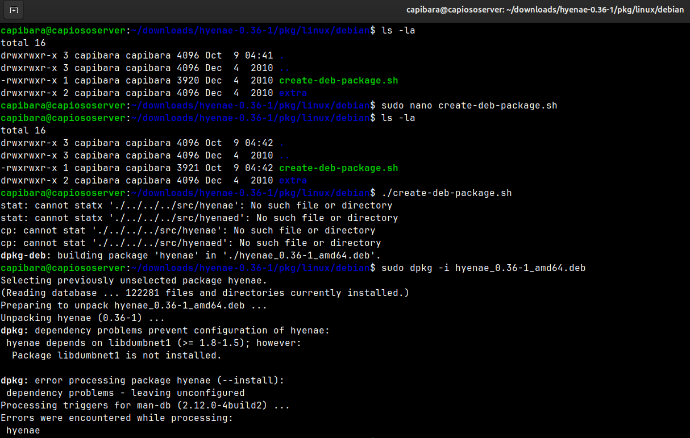
> 
> I even changed the architecture for generating the deb package because the server architecture was amd64:
> 
> 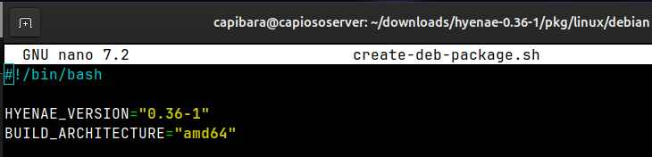
> 
> Finally, installing Hyenae and installing some needed packages:
> 
> 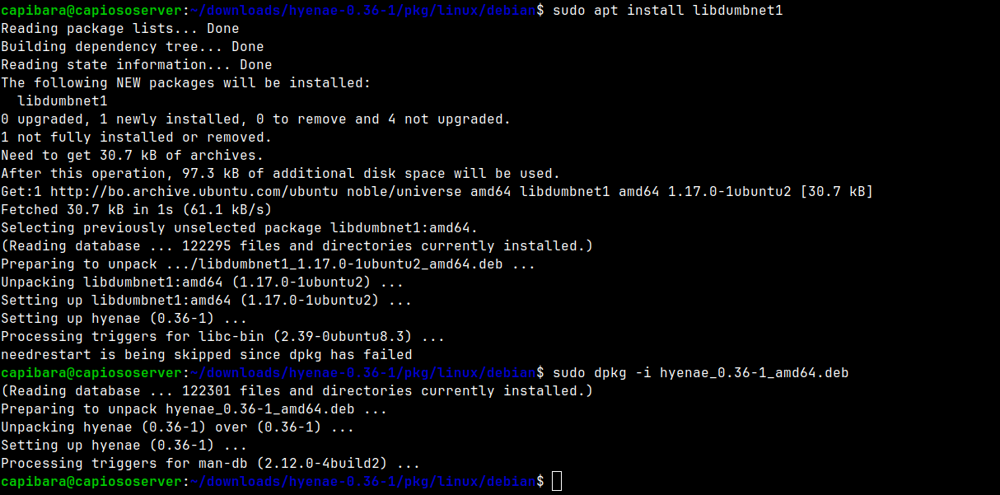
> 
> But, I realized that the commands of Hyenae weren't available, so I had to generate the binaries to INSTALL hyenae:
>
> * I applied `find` to check the PATH, there wasn't any reference to Hyenae then the installation was not right.
> * My research about generating binaries concluded in the use of `make` & build-essential to create the MAKEFILE.
> * Once I got these packages installed, I could generate the MAKEFILE by using the configure script which got downloaded with all other packages from Github.
> * At this point, there were some missing packages as libdumbnet-dev and libcap-dev which needed to be installed
> * After getting the MAKEFILE created, and checked with `dir` command, I could generate the needed binaries with `make`
> * Finally installing with `sudo make install`
> 
> 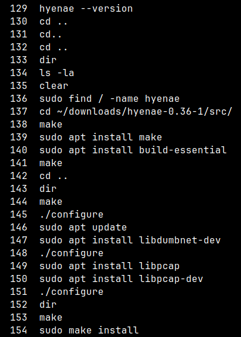
>
> Finally, checking Hyenae version (now the commands of Hyenae were available)
> 
> 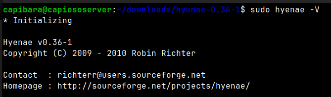

## Before DDOS attack
> Using htop and netstat previous to the DDOS attack:
>
> 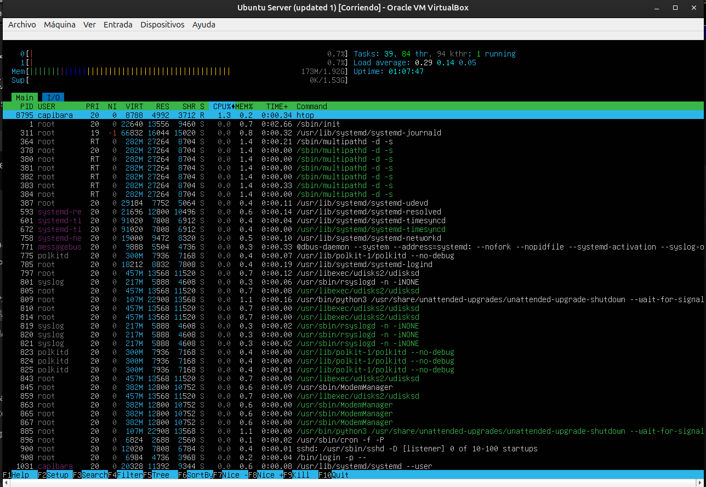
>
> ```shell
> capibara@capiososerver:~$ sudo netstat -an | grep ':80'
> tcp6       0      0 :::80                   :::*                    LISTEN     
> tcp6       0      0 2800:cd0:ad09:960:56732 2620:2d:4002:1::102:80  TIME_WAIT  
> ```

## Launching attack
> Fortunately, Hyenae included a manual to know how to use it.
> 
> 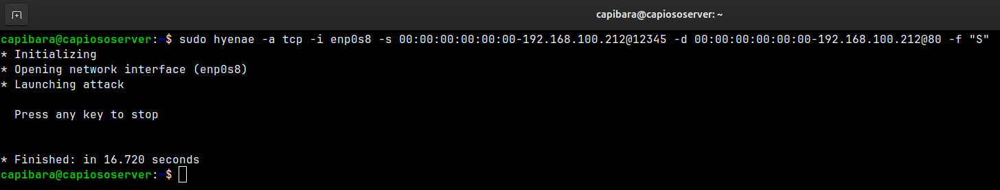
>
> I activated the attack for more than 15 seconds, at this point I realized that my machine was getting warmer.
## During DDOS attack
> Using htop and netstat during the DDOS attack:
> 
> 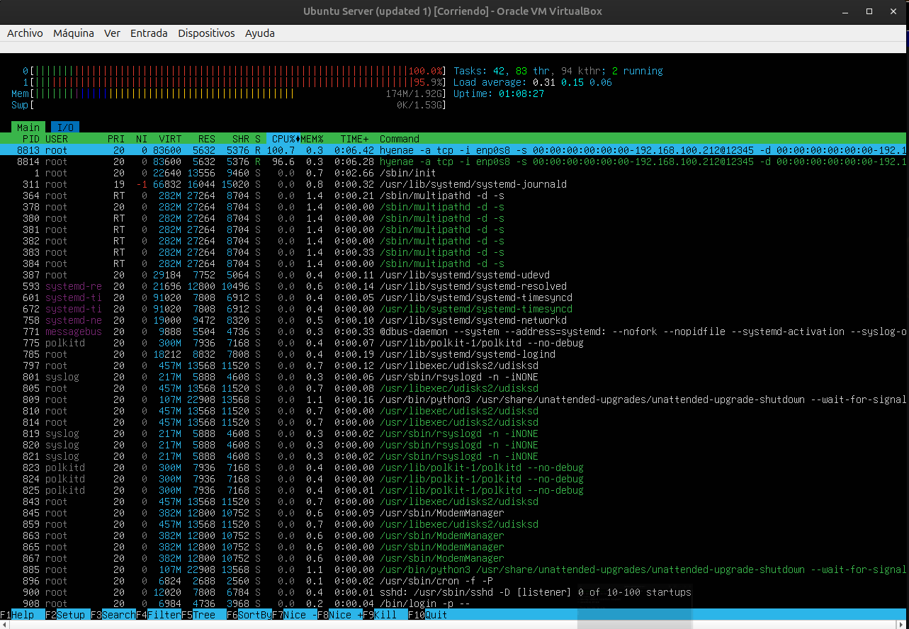
> 
> 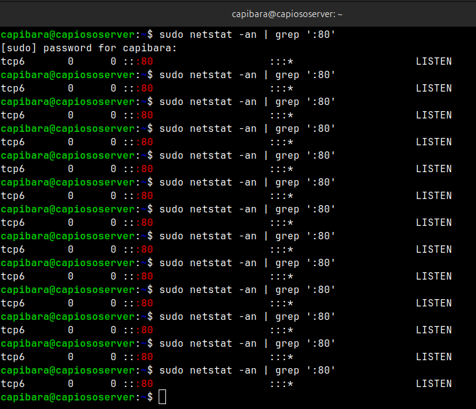

## Mitigation strategy
> By following the advices from [Cypher](https://cypfer.com/what-can-my-organization-do-about-ddos-threats/). I got the following mitigation strategies.

### Implement Robust Network Security Infrastructure
> The foundation of any effective DDoS defense strategy begins with a robust network security infrastructure. Businesses should invest in high-quality firewalls, intrusion detection systems (IDS), and intrusion prevention systems (IPS) that can monitor and filter out malicious traffic before it reaches critical systems. These security tools should be configured to detect abnormal traffic patterns that are indicative of a DDoS attack and respond accordingly.

### Leverage DDoS Protection Services
> Many organizations choose to supplement their in-house security measures with third-party DDoS protection services. These services offer advanced mitigation capabilities by diverting potentially malicious traffic away from the organization’s network and filtering it through their infrastructure. Companies like Cloudflare, Akamai, and AWS Shield provide DDoS protection services that can scale to handle massive amounts of traffic, ensuring that legitimate requests continue to reach your servers.

### Use Content Delivery Networks (CDNs)
> Content Delivery Networks (CDNs) are another effective way to mitigate the impact of a DDoS attack. CDNs distribute your content across multiple servers located around the world, reducing the load on any single server. In the event of a DDoS attack, the distributed nature of a CDN can help absorb and spread out the malicious traffic, making it more difficult for attackers to bring down your entire network.

### Adopt Rate Limiting and Traffic Shaping
> Rate limiting and traffic shaping are techniques that can help control the flow of incoming traffic, ensuring that no single source is able to overwhelm your servers. By limiting the number of requests that can be made to your servers within a certain timeframe, these measures can prevent attackers from easily flooding your network with excessive traffic. Implementing rate limiting at the application level can also protect against attacks that target specific functions or resources.

### Create a Response Plan
> Despite all preventive measures, it’s essential to have a well-defined DDoS response plan in place. This plan should outline the steps to take in the event of an attack, including how to identify the attack, how to communicate with internal teams and external stakeholders, and how to engage with your DDoS protection service provider. Regularly updating and testing this plan will ensure that your team is prepared to act quickly and effectively in the event of an attack.

### Ensure Redundancy and Failover Mechanisms
> Redundancy and failover mechanisms are critical components of a resilient network architecture. By distributing your critical services across multiple data centers or cloud environments, you can ensure that even if one location is affected by a DDoS attack, others can continue to operate. Automated failover mechanisms can quickly reroute traffic to unaffected servers, minimizing downtime and maintaining service availability.

### Educate and Train Your Team
> Human error can often be a weak link in cybersecurity defenses. Educating and training your team on DDoS threats and how to respond to them is essential. Regular training sessions can help employees recognize the signs of an attack and understand their role in the organization’s response plan. Additionally, conducting simulated DDoS attack exercises can help ensure that everyone knows what to do when an actual attack occurs.

### Monitor Traffic and Gather Intelligence
> Continuous monitoring of network traffic is vital for early detection of potential DDoS attacks. By analyzing traffic patterns and gathering intelligence on emerging threats, your organization can stay ahead of attackers. Implementing advanced threat detection solutions that use machine learning and artificial intelligence can provide deeper insights into traffic anomalies and help identify attacks in their early stages.

### Engage with Your ISP
> Your Internet Service Provider (ISP) plays a crucial role in defending against DDoS attacks. Establish a strong relationship with your ISP and ensure that they are equipped to help mitigate attacks on your network. Many ISPs offer DDoS mitigation services that can filter out malicious traffic before it even reaches your network, providing an additional layer of defense.

### Stay Informed About Emerging Threats
> The landscape of cyber threats is constantly evolving, and DDoS attack methods are becoming increasingly sophisticated. Staying informed about the latest trends and developments in DDoS threats is essential for maintaining a strong defense. Participate in industry forums, subscribe to cybersecurity newsletters, and engage with cybersecurity professionals to keep your knowledge up to date. Regularly reviewing and updating your DDoS mitigation strategy in light of new information will ensure that your organization remains protected against evolving threats.