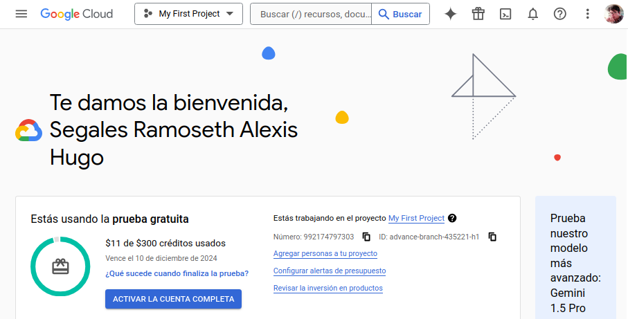

# Activity #1 - Introduction to Cloud Computing
> **Author:** *Alexis Segales*

## 1. Objective
Navigate through the home screen, identify the services offered according to the model: IaaS, PaaS, SaaS available in each one.

## 2. Google Cloud Console
I created an account for Google Cloud Console:

## 3. List of solutions

### 3.1. Administration
> Controls costs, manages identity and access, and uses APIs
> 
> |          **Name**          |              **Description**               | **Classification** |
> |:--------------------------:|:------------------------------------------:|:------------------:|
> |     APIs and Services      |     API management for cloud services      |      **SaaS**      |
> |          Billing           |     Billing and cost management tools      |      **SaaS**      |
> |   IAM and Administration   |        Access control for resources        |      **PaaS**      |
> | Google Cloud Configuration |  Set up and use a base of best practices   |      **PaaS**      |
> |       Gemini Manager       | Purchase and manage subscriptions in Cloud |      **SaaS**      |

### 3.2. Processing
> Runs scalable virtual machines and containers
> 
> |     **Name**      |                 **Description**                  | **Classification** |
> |:-----------------:|:------------------------------------------------:|:------------------:|
> |  Compute Engine   |               VMs, GPU, TPU, disks               |      **IaaS**      |
> | Kubernetes Engine |         Managed Kubernetes or containers         |      **PaaS**      |
> |   VMware Engine   |               VMware as a service                |      **IaaS**      |
> |       Batch       |                Jobs as a service                 |      **PaaS**      |
> | Workload Manager  | Deployment and operation of enterprise workloads |      **PaaS**      |

### 3.3. Storage
> Securely stores short-term, long-term, VM, and Filestore data
> 
> |     **Name**     |            **Description**             | **Classification** |
> |:----------------:|:--------------------------------------:|:------------------:|
> |  Cloud Storage   |       Enterprise object storage        |      **IaaS**      |
> |    Filestore     |        Fully managed NFS server        |      **IaaS**      |
> | Storage Transfer | A secure and flexible way to move data |      **IaaS**      |
> |    PowerScale    |  Enterprise file service in the cloud  |      **IaaS**      |
> |  Parallelstore   |      Managed parallel file system      |      **IaaS**      |
> |  NetApp Volumes  |       Fully managed file storage       |      **IaaS**      |
          
### 3.4. Analytics
> Collects, stores, processes, and analyzes large amounts of data
> 
> |             **Name**             |                            **Description**                             | **Classification** |
> |:--------------------------------:|:----------------------------------------------------------------------:|:------------------:|
> |             BigQuery             |                      Data warehouse and analytics                      |      **SaaS**      |
> |             Pub/Sub              |                       Global real-time messaging                       |      **SaaS**      |
> |             Dataflow             |                        Stream analytics service                        |      **PaaS**      |
> |             Composer             |                     Workflow orchestration service                     |      **PaaS**      |
> |             Dataproc             |                         Managed Apache Hadoop                          |      **PaaS**      |
> |             Dataprep             |                       Visual data transformation                       |      **SaaS**      |
> |           Data Fusion            |                        Data pipeline management                        |      **PaaS**      |
> |              Looker              |                      BI and enterprise analytics                       |      **SaaS**      |
> |            Healthcare            |                       Healthcare data management                       |      **SaaS**      |
> |        Financial Services        |                    Revenue growth through the cloud                    |      **SaaS**      |
> |          Life Sciences           |                      Large-scale biomedical data                       |      **SaaS**      |
> |          Elastic Cloud           |                Data to discover actionable intelligence                |      **SaaS**      |
> |            Databricks            |                  Platform for data, AI, and analytics                  |      **PaaS**      |
> |           Earth Engine           |               Planetary-scale platform for Earth science               |      **PaaS**      |
> | Managed Service for Apache Kafka |                 Apache Kafka service for all use cases                 |      **PaaS**      |
> |         Confluent Cloud          | Managed data streaming platform built on Apache Kafka and Apache Flink |      **PaaS**      |
> |           Data Catalog           |                      Metadata management service                       |      **SaaS**      |
> |             Dataplex             |                        Intelligent data fabric                         |      **PaaS**      |
> |            Datastream            |                   Streaming transfer and replication                   |      **PaaS**      |
> |          Looker Studio           |                        Scalable self-service BI                        |      **SaaS**      |
> | BigQuery Engine for Apache Flink |                   Serverless engine for Apache Flink                   |      **PaaS**      |

### 3.5. Networking Tools
> Manage, connect, secure, and scale your networks
> 
> |                **Name**                 |              **Description**              | **Classification** |
> |:---------------------------------------:|:-----------------------------------------:|:------------------:|
> |               VPC Network               |           Virtual private cloud           |      **IaaS**      |
> |            Network Services             |         Network management tools          |      **SaaS**      |
> |          Network Connectivity           |  Hybrid and network connectivity options  |      **IaaS**      |
> |            Network Security             |         Tools for secure networks         |      **SaaS**      |
> |          Network Intelligence           |      Network topology and monitoring      |      **SaaS**      |
> |          Network Service Tiers          |       Pricing and performance tiers       |      **SaaS**      |
> |         Spectrum Access System          |      Access to the shared CBRS band       |      **IaaS**      |
> |  Telecommunications Network Automation  | Automate telecom infrastructure and apps  |      **PaaS**      |

### 3.6. Distributed Cloud
> 
> |    **Name**     |              **Description**              | **Classification**  |
> |:---------------:|:-----------------------------------------:|:-------------------:|
> |  GDC Connected  |        Managed edge infrastructure        |      **IaaS**       |
> |     Devices     |  Devices for edge and transfer workloads  |      **IaaS**       |

### 3.7. Serverless
> Build applications with serverless containers and functions
> 
> |       **Name**        |           **Description**           | **Classification** |
> |:---------------------:|:-----------------------------------:|:------------------:|
> |       Cloud Run       |  Serverless for containerized apps  |      **PaaS**      |
> |  Cloud Run Functions  |  Event-based serverless functions   |      **PaaS**      |
> |      App Engine       |        Managed app platform         |      **PaaS**      |
> |      API Gateway      |  Develop, deploy, and manage APIs   |      **PaaS**      |
> |       Endpoints       |       Gateway for Cloud APIs        |      **PaaS**      |

### 3.8. Databases
> Create, manage, and migrate relational and non-relational databases
> 
> |            **Name**            |                    **Description**                    | **Classification** |
> |:------------------------------:|:-----------------------------------------------------:|:------------------:|
> |        Database Center         |   Dashboard for database fleets across all products   |      **SaaS**      |
> |            AlloyDB             |          Enterprise databases for PostgreSQL          |      **IaaS**      |
> |              SQL               |         Managed MySQL, PostgreSQL, SQL Server         |      **IaaS**      |
> |           Datastore            |          Serverless NoSQL document database           |      **PaaS**      |
> |           Firestore            |        NoSQL database for web and mobile apps         |      **PaaS**      |
> |            Spanner             |       Horizontally scalable relational database       |      **PaaS**      |
> |            Bigtable            | Petabyte-scale, low-latency, non-relational database  |      **IaaS**      |
> |          Memorystore           |      Managed Redis cluster, Redis and Memcached       |      **IaaS**      |
> |       Database Migration       |     Simplified migration to Cloud SQL and AlloyDB     |      **IaaS**      |
> |         MongoDB Atlas          |        JSON-style models, queries, and scaling        |      **IaaS**      |
> |           Neo4j Aura           |         Managed and integrated graph database         |      **IaaS**      |
> |          Redis Cloud           |          Robust in-memory database platform           |      **IaaS**      |
> |  Oracle Database@Google Cloud  |           Oracle workloads on Google Cloud            |      **IaaS**      |

### 3.9. Observability
> Understand the behavior, state, and performance of your applications
> 
> |    **Name**     |                   **Description**                   | **Classification** |
> |:---------------:|:---------------------------------------------------:|:------------------:|
> |     Logging     |        Real-time log management and analysis        |      **SaaS**      |
> |   Monitoring    | Quality control for infrastructure and applications |      **SaaS**      |
> | Error Reporting |             Application error dashboard             |      **SaaS**      |
> |      Trace      |           Application latency statistics            |      **SaaS**      |

### 3.10. Operations
> Compile, operate, and manage applications on Google Cloud
>
>|      **Name**      |             **Description**              | **Classification** |
>|:------------------:|:----------------------------------------:|:------------------:|
>|      Profiler      |          CPU and heap profiling          |      **PaaS**      |
>| Capacity Scheduler |   Check GCE usage forecast and maximum   |      **SaaS**      |
>|   Backup and DR    | Centralized backup and disaster recovery |      **SaaS**      |
>|      App Hub       |   Cloud app development and operations   |      **PaaS**      |

### 3.11. Security
> Achieve your compliance and policy goals
> 
> |   **Name**    |           **Description**            | **Classification**  |
> |:-------------:|:------------------------------------:|:-------------------:|
> |   Security    |  Features and controls for security  |      **SaaS**       |
> |  Compliance   |      Tools for data regulations      |      **SaaS**       |

### 3.12. Application Development
> Build full-stack web and mobile apps
> 
> |   **Name**   |            **Description**             | **Classification**  |
> |:------------:|:--------------------------------------:|:-------------------:|
> |   Firebase   |  Build full-stack web and mobile apps  |      **PaaS**       |

### 3.13. CI/CD
> Integrate and deliver continuously
> 
> |       **Name**        |              **Description**               | **Classification** |
> |:---------------------:|:------------------------------------------:|:------------------:|
> |      Cloud Build      |  Continuous integration delivery platform  |      **PaaS**      |
> |  Container Registry   |     Private Container Registry storage     |      **PaaS**      |
> |  Source Repositories  |      Hosted private Git repositories       |      **SaaS**      |
> |   Artifact Registry   |    Universal build artifact management     |      **PaaS**      |
> |     Cloud Deploy      |  Continuous delivery to GKE and Cloud Run  |      **PaaS**      |
> |        GitLab         |     Details on GitLab SaaS integration     |      **SaaS**      |

### 3.14. Artificial Intelligence
> Leverage machine learning products on a reliable platform
> 
> |       **Name**       |                             **Description**                              |  **Classification**  |
> |:--------------------:|:------------------------------------------------------------------------:|:--------------------:|
> |      Vertex AI       |  A unified platform for AI, all necessary machine learning capabilities  |       **PaaS**       |
> |     Translation      |                    Language detection and translation                    |       **SaaS**       |
> |     Document AI      |              Document analysis, classification, and search               |       **SaaS**       |
> |    Retail Search     |                   Data-driven solutions for retailers                    |       **SaaS**       |
> |   Talent Solution    |                            Job search with AI                            |       **SaaS**       |
> |    Agent Builder     |      A platform for search, recommendation, and conversational apps      |       **PaaS**       |
> |   Discovery Engine   |                 Discovery solutions for various sectors                  |       **SaaS**       |
> |    CCAI Platform     |                   Contact center as a service (CCaaS)                    |       **SaaS**       |
> |   Vertex AI Vision   |                      Image models now in Vertex AI                       |       **PaaS**       |
> |        Voice         |                Audio-to-text and text-to-audio conversion                |       **SaaS**       |

### 3.15. Integration Services
> Enable seamless operation of applications and microservices
> 
> |          **Name**          |                  **Description**                   | **Classification** |
> |:--------------------------:|:--------------------------------------------------:|:------------------:|
> |      Cloud Scheduler       |              Managed cron job service              |      **PaaS**      |
> |        Cloud Tasks         |            Asynchronous task execution             |      **PaaS**      |
> |         Workflows          |               Organize HTTP services               |      **PaaS**      |
> |          Eventarc          |               Modern event delivery                |      **PaaS**      |
> |  Application Integration   |        Enterprise application integrations         |      **SaaS**      |
> |   Integration Connectors   |      Connectivity for enterprise applications      |      **SaaS**      |
> |           Apigee           |                   API management                   |      **PaaS**      |
> |     Developer Connect      |  Connections to external source control platforms  |      **SaaS**      |

### 3.16. Tools
> Discover productivity resources for your cloud
>
> |       **Name**       |                **Description**                 | **Classification** |
> |:--------------------:|:----------------------------------------------:|:------------------:|
> |  Identity Platform   |            IAM with Google quality             |      **SaaS**      |
> |  Deployment Manager  |      Deploy infrastructure with templates      |      **IaaS**      |
> |   Service Catalog    |         Catalog of internal solutions          |      **SaaS**      |
> |    Active Assist     |  Proactively optimize your cloud environment   |      **SaaS**      |
> |   Carbon Footprint   |          Your cloud carbon emissions           |      **SaaS**      |
> |     Splunk Cloud     |        Platform to gain value from data        |      **SaaS**      |
> |   Migration Center   |         Move workloads to Google Cloud         |      **SaaS**      |
> |  Cloud Workstations  |         Cloud development environments         |      **IaaS**      |
> |    Service Status    |    Disruptive events affecting Google Cloud    |      **SaaS**      |

### 3.17. Web3
>  
> |         **Name**         |            **Description**            | **Classification** |
> |:------------------------:|:-------------------------------------:|:------------------:|
> |  Blockchain Node Engine  | Managed hosting for blockchain nodes  |      **IaaS**      |

### 3.18. Other Google Products
> Explore products for gaming and Google Maps Platform
> 
> |       **Name**       |             **Description**              | **Classification** |
> |:--------------------:|:----------------------------------------:|:------------------:|
> | Google Maps Platform | Real-world location data and experiences |      **SaaS**      |
> |   Immersive Stream   |      Photorealistic XR for everyone      |      **SaaS**      |
> |   Google Workspace   |        Transform how people work         |      **SaaS**      |

### 3.19. Support
> Access live support, developer communities, and self-service help
> 
> | **Name**  |          **Description**           | **Classification** |
> |:---------:|:----------------------------------:|:------------------:|
> |  Support  |  Basic free help or paid packages  |      **SaaS**      |

