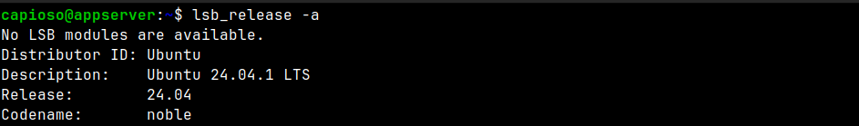

# Activity #2 - Cloud Computing Instance
> **Author:** *Alexis Segales*

<!-- TOC -->
* [Activity #2 - Cloud Computing Instance](#activity-2---cloud-computing-instance)
  * [1. Objectives](#1-objectives)
  * [2. Compute Engine in Google Cloud](#2-compute-engine-in-google-cloud)
  * [3. Remote access](#3-remote-access)
  * [4. Instance' creation parameters](#4-instance-creation-parameters)
  * [5. Instance' created parameters](#5-instance-created-parameters)
    * [5.1. OS](#51-os)
    * [5.2. RAM](#52-ram)
    * [5.3. Storage](#53-storage)
    * [5.4. Process Power](#54-process-power)
    * [5.5. CPU current state](#55-cpu-current-state)
  * [6. Pricing](#6-pricing)
<!-- TOC -->

## 1. Objectives
> * Start a free VM instance on one of the selected platforms
> * Check the key configuration for remote access
> * Once connected check the available resources on the VM such as Operating System, Memory, Available Space and Processing Capacity.
> * Demonstrate how to connect using a remote access tool.
> * Explore the basic functionality of the VM, install a simple SW or experiment with some of the console tools available.

## 2. Compute Engine in Google Cloud
> * As I decided to work with Google Cloud and use the Google Cloud Console, the VM instance got created by using the Compute Engine Service.
> * I currently have 2 VM instances running:

## 3. Remote access
> * The preferred way to connect to these VM instances is by using SSH, which by default is enabled:

> * The options include the possibility to connect by creating a pair of keys directly in the browser, by using gcloud, and my favorite, creating the keys in a local machine and just register it on the VM instance.

> * For example, each time you open a console directly on the browser, it generates the keys and register them on the instance:

> * The last keys were added by me and generated in my local machine.
> * I ain't going to publish the IP address from my instance but, I can show you that I can connect by using my private key generated from my local machine:

> * If by any reason the ssh port is not enabled, it is possible to change it by going to VPC network:

## 4. Instance' creation parameters

## 5. Instance' created parameters
### 5.1. OS

### 5.2. RAM

### 5.3. Storage

### 5.4. Process Power

### 5.5. CPU current state

## 6. Pricing
This is the accumulated price for a month of service.

