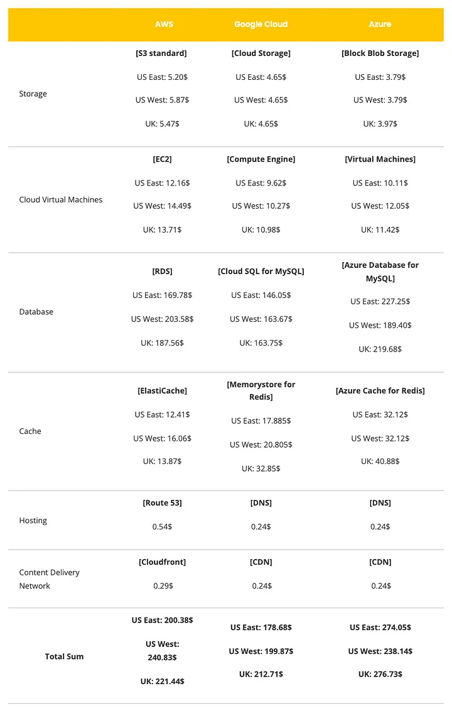

# Activity #3 - Cloud Platform Analysis
> **Author:** *Alexis Segales*

<!-- TOC -->
* [Activity #3 - Cloud Platform Analysis](#activity-3---cloud-platform-analysis)
  * [1. Amazon Web Services](#1-amazon-web-services)
    * [1.1 Pros](#11-pros)
    * [1.2. Cons](#12-cons)
  * [2. Microsoft Azure](#2-microsoft-azure)
    * [2.1. Pros](#21-pros)
    * [2.2. Cons](#22-cons)
  * [3. Google Cloud](#3-google-cloud)
    * [3.1. Pros](#31-pros)
    * [3.2. Con](#32-con)
  * [4. Pricing](#4-pricing)
  * [5. Bibliography](#5-bibliography)
<!-- TOC -->

## 1. Amazon Web Services
### 1.1 Pros
> * Provides most services, from networking to robots.
> * Most mature
> * Considered the best for reliability and security
> * More computational capacity than Azure and GCP
### 1.2. Cons
> * All major software providers that make their applications available on AWS Dev/Enterprise support must be paid.
> * The sheer quantity of services and options available can be overwhelming for newbies.
> * There are relatively few hybrid cloud alternatives.

## 2. Microsoft Azure
### 2.1. Pros
> * Integration and migration of current Microsoft services are simple.
> * Many options are accessible, including best-in-class AI, machine learning, and analytics services.
> * Most services are less expensive when compared to AWS and GCP.
> * There is a lot of support for hybrid cloud strategies.
### 2.2. Cons
> * Fewer service choices compared to AWS
> * Specifically designed for business customers

## 3. Google Cloud
### 3.1. Pros
> * Works well with other Google services and products.
> * Excellent containerized workload support
### 3.2. Con
> * Limited services compared to AWS and Azure Limited support for enterprise use cases

## 4. Pricing

|      **Cloud Pricing Models Comparison**       |                       **AWS**                       |                 **Azure**                 |          **GCP**          |
|:----------------------------------------------:|:---------------------------------------------------:|:-----------------------------------------:|:-------------------------:|
|               **Pay-as-you-go**                |         Yes, billed per second or per hour          |     Yes, billed per second or minute      |  Yes, billed per minute   |
|             **Reserved instances**             |                       RI, SP                        |               Savings plan                |           CUDs            |
|       **Discount range for commitments**       |                  Up to 75% for RIs                  |        Up to 72% for Reservations         |     Up to 57% for CUD     |
|  **Cancellation policy for commitment plans**  |              Possible with limitations              |            Possible for a fee             |       Not possible        |
|               **Spot instances**               |                         Yes                         |                    Yes                    |            Yes            |
|                 **Free tier**                  |  Free trials, 12 months free, always-free services  |    12 month free, always-free services    |   Always-free services    |
|                  **Credits**                   |                         No                          |        $200 for the first 30 days         |           $300            |
|               **Unique feature**               |                Flexible saving plans                |  A range of additional discount programs  |  Credit without deadline  |

## 5. Bibliography
> * Danikovich, D. (2024, junio 27). Cloud pricing comparison: AWS vs Azure vs GCP. EffectiveSoft. https://www.effectivesoft.com/blog/cloud-pricing-comparison.html
> * Vasylkiv, B. (2022, septiembre 6). AWS vs GCP vs Azure: What about prices? - Bohdan Vasylkiv. Medium. https://medium.com/@bohdan.vasylkiv/aws-vs-gcp-vs-azure-what-about-prices-749bd169d6a9
> * What’s the difference between AWS vs. Azure vs. Google cloud? (2022, agosto 10). Coursera. https://www.coursera.org/articles/aws-vs-azure-vs-google-cloud
> * Wickramasinghe, S. (s/f). AWS vs azure vs GCP: Comparing the big 3 cloud platforms. BMC Blogs. Recuperado el 9 de octubre de 2024, de https://www.bmc.com/blogs/aws-vs-azure-vs-google-cloud-platforms/